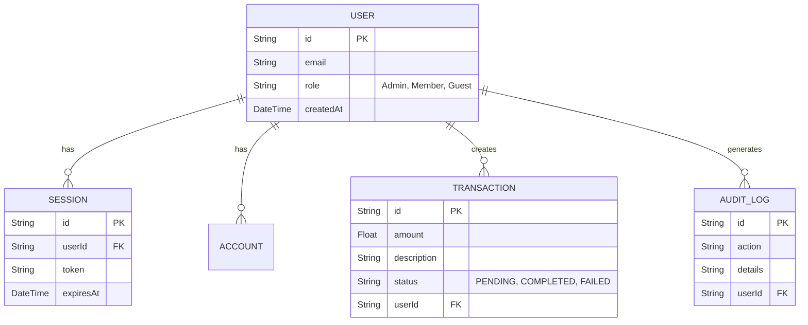
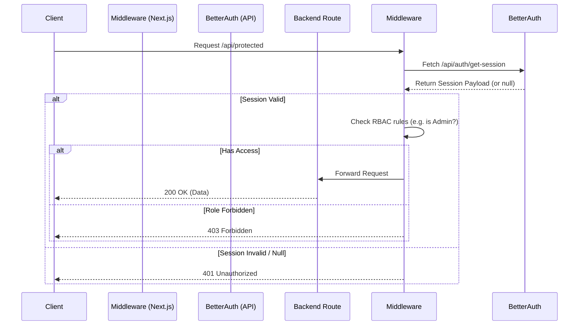
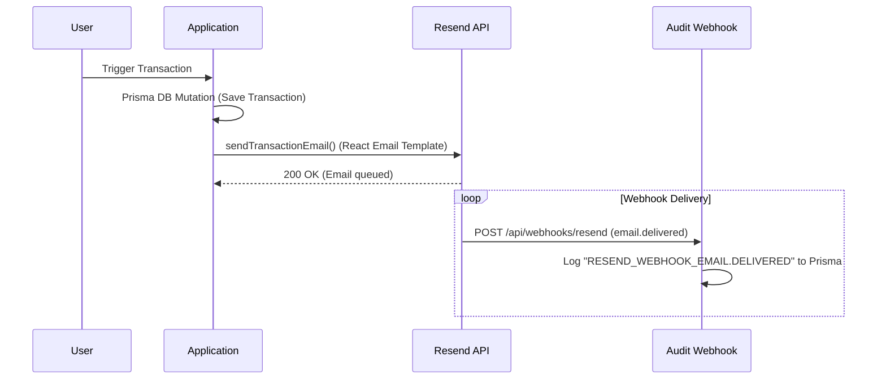

# System Architecture Note: Automated Data Pipeline & Security Services

This document serves as the architecture note for Assignment 2, outlining the data relationships, authorization flow, and the email dispatch pipeline.

## 1. Data Relationships (Prisma ERD)

The system leverages Prisma ORM to define a highly structured, relational database scheme (PostgreSQL/MySQL).



### Explanation of the Schema
- **User**: The core entity storing identity and Role-Based Access Control (RBAC) scopes.
- **Transaction**: Records of monetary or business actions tied strictly to a registered user.
- **AuditLog**: A comprehensive audit trail to monitor system events, particularly webhook callbacks from our email service provider.

## 2. Authorization Flow Diagram (Better Auth + Next.js Middleware)

The authorization pipeline ensures secure session persistence and proxy-level route protection.



### Authorization Pipeline Components
1. **Better Auth API**: Handles the cryptographic signing and verification of sessions via the Prisma adapter.
2. **Next.js Middleware (`middleware.ts`)**: Acts as a proxy gatekeeper. It intercepts traffic on protected route segments (`/api/protected/*` and `/api/admin/*`) and performs an RBAC validation check before reaching the Server Actions or Route Handlers.

## 3. Transactional Lifecycle Dispatch (Resend + React Email)

Automated system notifications and tracking are achieved by connecting our backend to the Resend API.



### Email Dispatch Pipeline
1. **React Email (`TransactionalTemplate.tsx`)**: Renders modular, stylized email components into standard HTML based on the transaction status.
2. **Resend API (`lib/email.ts`)**: Integrates directly with Resend to dispatch the React Email payload to the target user.
3. **Webhook Ingestion (`route.ts`)**: Ingests asynchronous callback events from Resend, guaranteeing that bounce or delivery logs are captured directly in the relational `AuditLog` table for data integrity.

---

## Appendix: Terminal Logs for Migration & Seeding (SQLite/PostgreSQL Simulation)

```console
$ npx prisma migrate dev --name init
Environment variables loaded from .env
Prisma schema loaded from prisma\schema.prisma
Datasource "db": SQLite database "dev.db" at "file:./dev.db"

Applying migration `20260918123523_init`
The following migration(s) have been created and applied from new schema changes:
prisma\migrations/
  └─ 20260918123523_init/
    └─ migration.sql
Your database is now in sync with your schema.
✔ Generated Prisma Client (v6.x) to .\node_modules\@prisma\client

$ npx tsx prisma/seed.ts
Clearing existing data...
Seeding Database...
Created user: Simeon_Donnelly26@gmail.com with role: Member
Created user: Johnnie76@gmail.com with role: Admin
Created user: Chesley.Runolfsdottir96@yahoo.com with role: Admin
Created user: Neva72@hotmail.com with role: Guest
Created user: Gus82@hotmail.com with role: Member
Created user: Rosemary64@hotmail.com with role: Admin
Created user: Enola23@hotmail.com with role: Member
Created user: Emmanuelle67@hotmail.com with role: Admin
Created user: Eileen58@yahoo.com with role: Admin
Created user: Denis16@hotmail.com with role: Admin
Seeding completed successfully.
```
